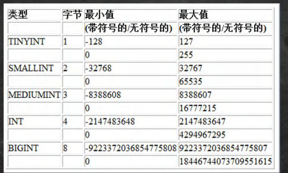

# 1. mysql常用数据类型（列类型）
    分类
        数值类型
        文本、二进制类型
        时间日期
## 数值型（整数）的基本使用
    说明，使用规范：在能够满足需求的情况下，尽量选择占用空间小的

## 数值型（bit）的基本使用
    细节说明
    1.bit字段显示时，按照位的方式显示
    2.查询的时候仍然可以用添加的数值
    3.如果一个值只有0,1 可以考虑使用bit(1),可以节约空间
    4.位类型，M指定位数，默认1，范围1-64
    5.使用不多
## 数值型（小数）的基本使用
    1.FLOAT/DOUBLE [unsigned]
    float单精度，double双精度
    2.DECIMAL[M,D][unsigned]
        可以支持更加紧缺的小数位，M是小数位数（精度）的总数，D是小数点后面
        的位数
        如果D是0，则只没有小数点或分数部分。M最大65。D最大30.如果D被省略，默认是0
        如果M被省略，默认是10
        建议：如果希望小数的精度高，推荐使用decimal

## 字符串的基本使用
    CHAR(size) 
    固定长度字符串最大255字符
    VAECHAR(size)
    可变长度字符串，最大65532字节 [utf8编码最大21844字符 1-3字节用于记录大小]
## 字符串使用细节
    1.细节1
     char(4) //这个4表示字符数（最大255），不是字节数，不管是中文还是字母都
    是放四个，按字符计算。
    varchar(4)//这个4表示字符数，不管是中文还是字母都以定义好的表的编码
    来存放数据
    不管是中文还是英文字母，都是最多存放4个，是按照字符来存放的。

    2.细节2
    char(4)是定长（固定长度），就是说，即使你插入'aa',也会占用分配的4个字符的空间。
    varchar(4)是变长（变化的大小），就是说，如果你插入'aa',实际占用空间大小并不是4个字符，
    而是按照实际占用空间来分配（说明：varchar本身还需要占用1-3个字节来记录存放内容长度）
    L（实际数据大小）+（1-3）字节

    3.细节3
    什么时候使用char,什么时候使用varchar
    1.然后数据是定长，推荐使用char，比如MD5的密码，邮编，手机号，身份证号等
    2.如果一个字段的长度是不确定，我们使用varchar,比如留言，文章
    查询速度：char>varchar

    4.细节4
    在存放文本时，也可以使用Text数据类型，可以将TEXT列视为varchar列，注意text不能有默认值，   
    大小0-2^16字节
    如果希望存放更多字符，可以选择MEDIUMYEXT 0-2^24 或者LONGTEXT 0-2^32

## 日期类型的基本使用
    CREATE TABLE birthday6(
        t1 DATE,
        t2 DATETIME,
        t1 TIMESTAMP NOT NULL DEFAULT
        CURRENT_TIMESTAMP ON UPDATE
        CURRENT_TIMESTAMP
    ); timestamp 时间戳
    日期类型的细节说明
    timestamp在insert和update时，自动更新

    
    