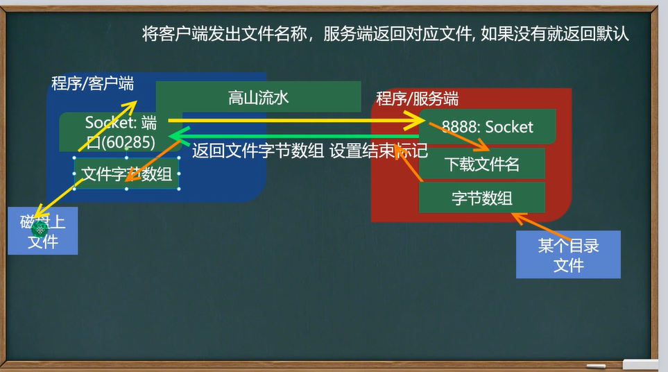

# TCP应用案例之文件下载
    1.编写客户端程序和服务端程序
    2.客户端可以输入一个音乐文件名,比如高山流水,服务端,收到音乐名后,可以给
    客户端返回这个音乐文件,如果服务器没有这个文件,返回一个默认的音乐即可
    3.客户端收到文件后,保存到本地D:\\
    4.提示:该程序可以使用StreamUtils.java

## 示意图及思路

    服务端:参考(Homework03Server_.java,Homework03Client_.java)
        1.监听9999端口,并接收下载文件的名字
        2.等待客户端连接
        3.读取客户端发送的要下载的文件名
        4.创建一个输入流读文件
        5.使用工具类StreamUtils,读取文件到一个字节数组
        6.得到socket关联的输出流
        7.写入到数据通道返回给客户端,并设置结束标志
        8.关闭资源
    客户端:
        1.创建scanner对象接收用户输入指定下载文件名
        2.连接服务端准备发送
        3.发送获取和socket关联的输出流,并设置写入结束标志
        4.读取服务端返回的文件(字节数据)bis读取
        5.得到一个输出流,准备将字节数组写到磁盘,确定文件路径
        6.关闭资源