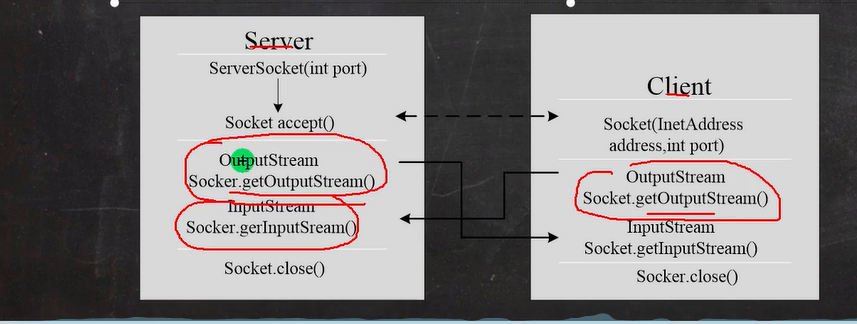
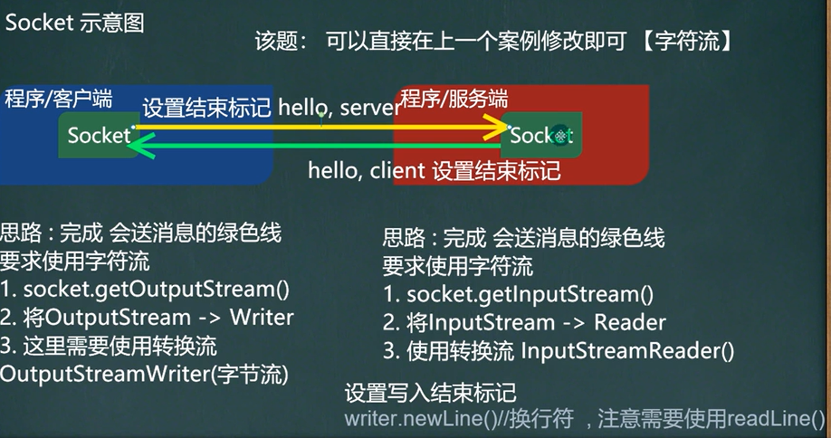

# 1.基本介绍
    1.基于客户端-服务端的网络通信
    2.底层使用的是TCP/IP协议
    3.应用场景举例:客户端发送数据,服务端接受并显示控制台
    4.基于Socket的TCP编程

## 应用案例1(使用字节流)
    1.编写一个服务端,一个客户端
    2.服务端在9999端口监听
    3.客户端连接到服务器端,发送"hello , server",然后退出
    4.服务器端接收到客户端发送的信息,输出,并退出
        代码参考SocketTCP01Server.java,SocketTCP01Client.java
        思路:
        服务端:
        1.在本机 的 9999 端口监听, 等待连接
        2.等待客户端连接,没有客户端连接会阻塞
         如果有客户端连接，则会返回 Socket 对象，程序继续
        3.通过socket.getInputStream()读取客户端写入到数据通道的数据
        4.IO读取
        5.关流和socket
        客户端:
        1.连接服务端 (ip , 端口）
        2. 连接上后，生成 Socket, 通过 socket.getOutputStream()
        3. 通过输出流，写入数据到 数据通道
        4. 关闭流对象和 socket, 必须关闭

## 应用案例2(使用字节流)
    1.编写一个服务端,一个客户端
    2.服务端在9999端口监听
    3.客户端连接到服务器端,发送"hello , server",并接收服务器端回发的
    "hello,client",再退出
    4.服务器端接收到客户端发送的信息,输出,并发送"hello,client",再退出
        思路:
        服务端:
        1.在本机 的 9999 端口监听, 等待连接
        2.等待客户端连接,没有客户端连接会阻塞
         如果有客户端连接，则会返回 Socket 对象，程序继续
        3.通过socket.getInputStream()读取客户端写入到数据通道的数据
        4.IO读取,显示
        5. 获取 socket 相关联的输出流,并写入对应要发送的数据
        6.设置写入结束标记,表示后面没有数据写入(socket.shutdownOutput();)
        7.关流和socket
        客户端:
        1.连接服务端 (ip , 端口）
        2. 连接上后，生成 Socket, 通过 socket.getOutputStream()
        3. 通过输出流，写入数据到 数据通道
        4.设置写入结束标记,表示后面没有数据写入(socket.shutdownOutput();)
        5.通过socket.getInputStream()读取服务端写入到数据通道的数据
        6. 关闭流对象和 socket, 必须关闭

## 应用案例3(使用字符流)
    1.编写一个服务端,一个客户端
    2.服务端在9999端口监听
    3.客户端连接到服务器端,发送"hello , server",并接收服务器端回发的
    "hello,client",再退出
    4.服务器端接收到客户端发送的信息,输出,并发送"hello,client",再退出

        
    思路:
        服务端:
        1. 在本机 的 9999 端口监听, 等待连接
        2. 当没有客户端连接 9999 端口时，程序会 阻塞, 等待连接
        如果有客户端连接，则会返回 Socket 对象，程序继续,即调用serverSocket.accept();
        3.通过 socket.getInputStream() 读取客户端写入到数据通道的数据, 显示
        4. IO 读取, 使用字符流, 老师使用 InputStreamReader 将 inputStream 转成字符流
           然后将InputStreamReader对象传给BufferedRead构建BufferedRead对象
            写完后需要
            bw.newLine();// 插入一个换行符，表示回复内容的结束                
            bw.flush();//注意需要手动的 flush
        5. 获取 socket 相关联的输出流
        6.关闭流(外层流即可)和 socket

        客户端:
        1. 连接服务端 (ip , 端口）
        2. 连接上后，生成 Socket, 通过 socket.getOutputStream()
        3. 通过输出流，写入数据到 数据通道, 使用字符流
           将outputstream对象传入构建转换流outputstreamwriter对象,
           然后将OutputStreamwriter对象传入构建bufferedwriter对象
            写完后需要
            bw.newLine();// 插入一个换行符，表示回复内容的结束                
            bw.flush();//注意需要手动的 flush
        4. 获取和 socket 关联的输入流. 读取数据(字符)，并显示
        5. 关闭流对象(外层流)和 socket, 必须关闭

        
## 应用案例4(网络上传文件1)
    参考TCPFileUploadServer.java TCPFileUploadClient.java
    1.编写一个服务端,一个客户端
    2.服务端在9999端口监听
    3.客户端连接到服务器端,发送一张图片e:\\qie.png
    4.服务器端接收到客户端发送的图片,保存到src下,并发送"收到图片",再退出
    5.客户端接收到服务端发送的"收到图片",再退出
    6.该程序要求使用StreamUtils.java,我们直接使用