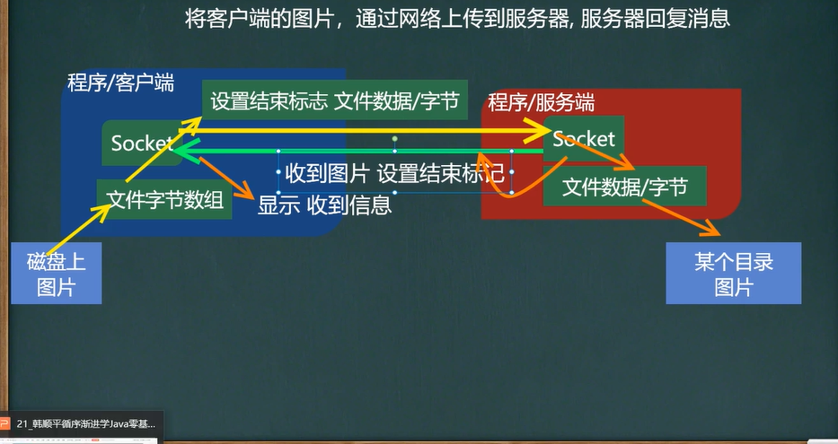

# 应用案例4(网络上传文件1)
    参考TCPFileUploadServer.java TCPFileUploadClient.java
    1.编写一个服务端,一个客户端
    2.服务端在8888端口监听
    3.客户端连接到服务器端,发送一张图片e:\\qie.png
    4.服务器端接收到客户端发送的图片,保存到src下,并发送"收到图片",再退出
    5.客户端接收到服务端发送的"收到图片",再退出
    6.该程序要求使用StreamUtils.java,我们直接使用

        思路:
            服务端:
                1.编写服务端监听8888端口
                2.等待客户端连接
                10.读取客户端发送的数据,通过socket得到输出流bis,然后得到字节数组
                    (即为客户端上传的图片数据的字节数组)
                11.将得到的字节数组写入到指定要上传服务端的路径,就上传完成
                11.关流和socket,serversocket
    
        客户端:
            3.客户端连接服务端888端口,得到socket对象
            4.创建读取磁盘文件(客户端要上传的图片)的输入流
            5.得到图片对应的字节数组
            6.通过socket获取到输出流,将字节数组写入传送通道(即发送给服务端)
            7.设置结束标记,关流
            8.通过socket得到输出流读取服务端的消息
            9.关流和socket