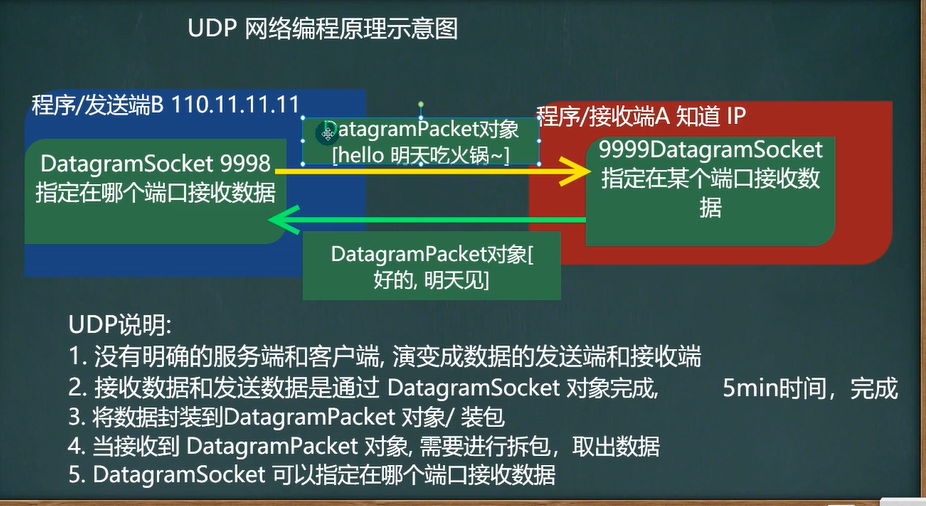

# 1.基本介绍
    1.类DatagramSocket和DatagramPacket[数据包/数据报]实现了了基于UDP
      协议网络程序
    2.UDP数据报通过数据报套接字DatagramSocket发送和接收,系统不保证UDP
      数据报一定能够安全送到目的地,也不能确定什么时候可以抵达
    3.DatagramPacket对象封装UDP数据报,在数据报中包含了发送端的IP地址和
      端口号以及接收端的IP地址和端口号
    4.UDP协议中每个数据报都给出了完整的地址信息,因此无需建立发送方和接收方
     的连接

# 基本流程
    1.核心两个类/对象DatagramSocket与DatagramPacket
    2.建立发送端,接收端(没有服务端和客户端概念)
    3.发送数据前,建立数据包/数据报 ,DatagramPacket对象
    4.调用DatagramSocket的发送,接收方法
    5.关闭DatagramSocket

## 应用案例
    1.编写一个接收端A和一个发送端B
    2.接收端A在9999端口等待接收数据(receive)
    3.发送端B向接收端A发送数据"hello,明天吃火锅.."
    4.接收端A接收到发送端B发送的数据,回复"好的,明天见",再退出
    5.发送端接收回复数据,在退出

    思路:代码参考UDPReceiverA.Java ,UDPSenderB.Java
        接收端A:
            //1. 创建一个 DatagramSocket 对象，准备在 9999 接收数据
            //2. 构建一个 DatagramPacket 对象，准备接收数据
            //3. 调用 接收方法, 将通过网络传输的 DatagramPacket 对象
            //4. 可以把 packet 进行拆包，取出数据，并显示.
            //===回复信息给 B 端
            //将需要发送的数据，封装到 DatagramPacket 对象
            //5. 关闭资源
        发送端B:(发送端 B ====> 也可以接收数据)
            //1.创建 DatagramSocket 对象，准备在 9998 端口 接收数据
            //2. 将需要发送的数据，封装到 DatagramPacket 对象      
            //3.=== 接收从 A 端回复的信息
                //(1) 构建一个 DatagramPacket 对象，准备接收数据
                //(2) 调用 接收方法, 将通过网络传输的 DatagramPacket 对象
                //(3) 可以把 packet 进行拆包，取出数据，并显示.
            //关闭资源
