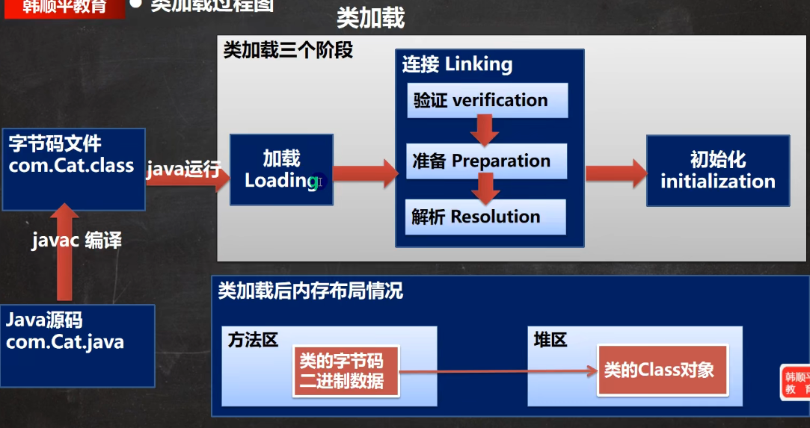
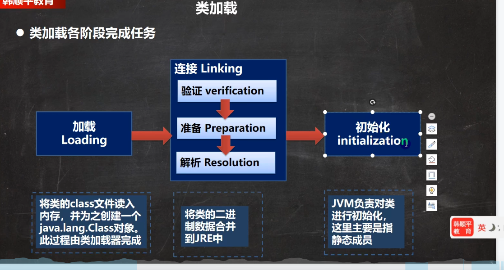

# 类加载
## 1.基本说明
    反射机制是Java试下动态语言的关键，也就是通过反射实现类动态加载。
    1.静态加载：编译时加载相关的类，如果没有则报错，依赖性太强
    2.动态加载：运行时加载需要的类，如果运行时不用该类，即使不存在该类，则
    不报错，降低了依赖性

## 2.类加载时机
    1.当创建对象时（new）//静态加载
    2.当子类被加载时，父类也加载 //静态加载
    3.调用子类中的静态成员时 //静态加载
    4.通过反射 //动态加载
    Class.forName("com.zhu.reflection_.Cat");
## 3.类加载过程图

## 4.类加载各阶段完成任务

## 5.加载阶段
    JVM在该阶段的主要目的是将字节码从不同的数据源(可能是class文件、
    有可能是jar包，甚至网络)转化为二进制字节流加载到内存中，并生成
    一个代表该类的java.lang.Class对象
## 6. 连接阶段-验证
    1.目的是为了确保class文件的字节流中包含的信息符合当前虚拟机的要求，并且
     会危害虚拟机自身的安全。
    2.包括：文件格式验证(是否以魔数oxcafebabe开头)、元元数据验证、字节码验证
     和符号引用验证
    3.可以考虑使用-Xverify:none参数来关闭大部分的类验证措施，缩短虚拟机类加载的
     时间
## 7.连接阶段-准备
    1.JVM会在该阶段对静态变量，分配内存并默认初始化(对应数据类型的默认初始值，如0、
      0L、null、false等)。这些变量所使用的内存都将在方法区中进行分配
    2.举例说明ClassLoad02.java

## 8.连接阶段-解析
    1.虚拟机将常量池内的符号引用替换为直接引用的过程。
## 9. Initialization（初始化)
    1.到初始化阶段，才真正开始执行类中定义的Java程序代码，此阶段是执行
       <clinit>()方法的过程。
    2.<clinit>()方法是由编译器按语句在源文件中出现的顺序，依次自动收集类中的
      所有静态变量的赋值动作和静态代码块中的语句，并进行合并
    3.虚拟机会保证一个类的<clinit>()方法在多线程环境中被正确的加锁、同步，如果
     多个线程同时去初始化一个类，那么只会有一个线程去执行这个类的<clinit>()方法
     ，其他线程都需要阻塞等待，直到活动线程执行<clinit>()方法完毕

